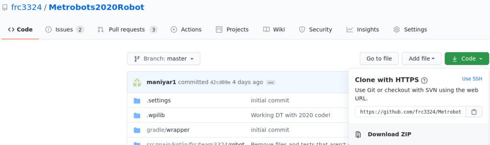

# Introduction to Git
## Preface
Git is a historically hard concept to learn, so feel free to take your time, experimenting is to be expected, and we all fail sometimes. 

## Goal
Introduce the reader to git, get them to create and clone a repository, edit the repository’s README, and finally commit and push their changes.

## What Is Git?
Git is Version Control Software (VCS), a term generally use to refer to a piece of software that in our case will help keep snapshots of the robot code over time. 
Git also enables us to collaborate together, assists with bug-fixing, and provides redundancy in case the server goes down.

## What Is Github?
Github is the server/service we’re going to use to host all the robot code. 
In a stroke of luck the first students who made the Github in 2012 decided on a very functional naming scheme that we still use to this day. 
You can checkout all our team’s old code since 2012 on the [3324 Github page](https://github.com/frc3324). Github also enables the [forking workflow](https://www.atlassian.com/git/tutorials/comparing-workflows/forking-workflow) (will be covered later).

## Getting The Code
Please make a Github account as per [the git setup instructions](https://new.3324metrobots.org/2020/07/02/git-setup/).
Then create a new repository with a README, and clone it onto your computer by entering this command into your terminal or git bash (omitting the $): 
```shell
$ git clone <your-repository-link>
```

Your repository link can be found here:



This will clone your repository to whichever folder you were when you ran the “git clone” command. 
Now, go to that folder with your preferred editor, and open the README.md file. 
Make any changes you want (doesn’t matter what they are for the purposes of this document).

Alright, you are now ready to “stage”, “commit”, and “push” your changes.

## Pushing The Code

So at this point you have changed your README file and “just” need to push it up to the server. 
This will take three steps.

1. **Staging**: 
In git we have to “stage” changes, this tells git to add the changes to the next commit. 
This is in case you don’t want to commit some changed files or you’re still working on them.

2. **Commit**: 
A commit updates a snapshot with your changes, (normally) assigning you as an author, and also requires a message. 
We will talk about commit message etiquette later. 

3. **Pushing**: 
Pushing simply “pushes” your commits to the server, which for the purposes of this document means syncing up the server with your computer. 

To “stage” all your changes run:
```shell
$ git add .
```
To make a commit message type:
```shell
$ git commit -m <message>
```
Make sure to change `<message>` to a simple changelog message, for example “Changed README.md”
This is not best practice but it’s okay for now.

Finally, to push the code to the repository, run: 
```shell
$ git push
```

## Summary
This document went over how to create a Github repository, clone your repository, make some changes, stage your changes, commit your changes, and finally push them back to the server. 
This may seem like a ton of effort for essentially “google docs” functionality, but over time you will realize the flexibility and power this complexity grants you.

## Sources & Resources
- [Chapters 1 and 2 of the Git book are highly recommended](https://git-scm.com/book/en/v2)
- [3512’s Git Presentation (not everything here applies)](https://csweb.frc3512.com/ci/intro-to-git/lecture/)
- [Random internet slideshow about git 101](https://www.slideshare.net/HubSpot/git-101-git-and-github-for-beginners)
