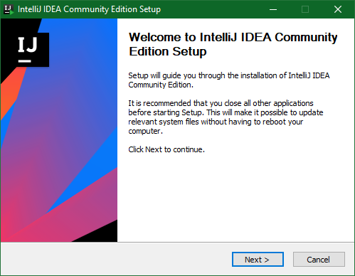
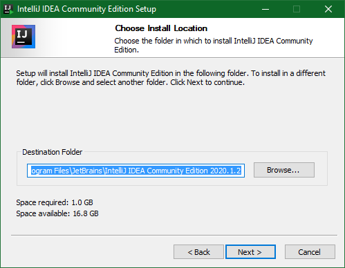
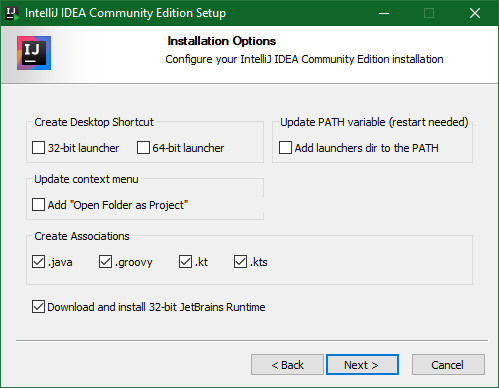
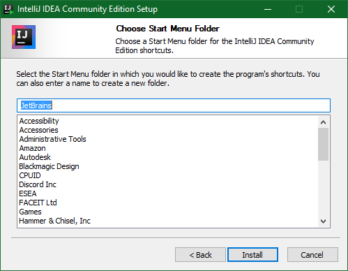
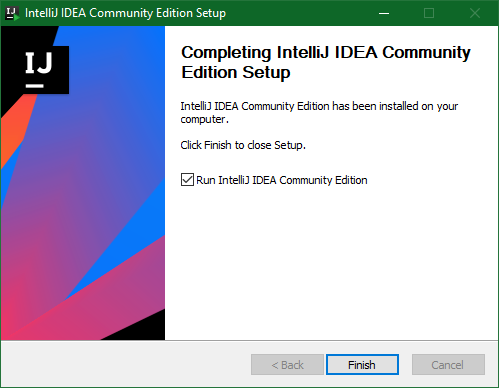
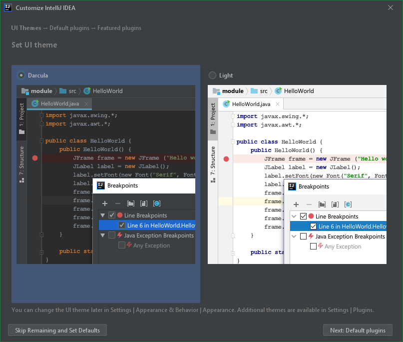

# Installing IntelliJ

## Windows
Go to [the windows download link](https://www.jetbrains.com/idea/download/#section=windows)
Then download the community version, and open it.

Click "Next"

Click "Next"

Fill the same boxes as seen here and click "Next".

Click "Install"

Make sure to tick "Run IntelliJ IDEA Community Edition", and click "Finish".

Choose whatever theme you want, and then click "Skip Remaining and Set Defaults"

